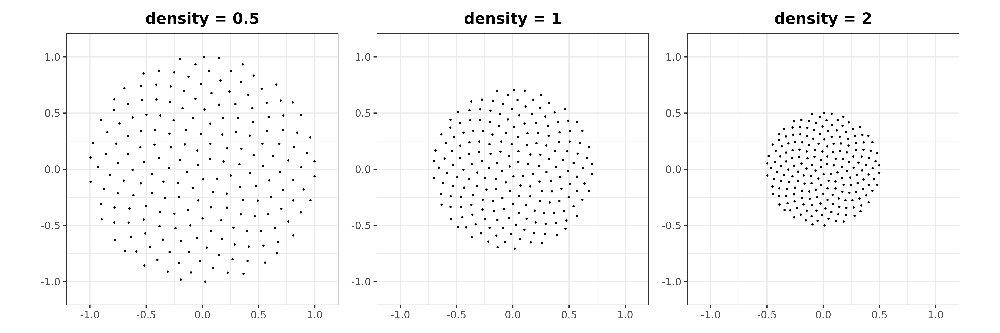
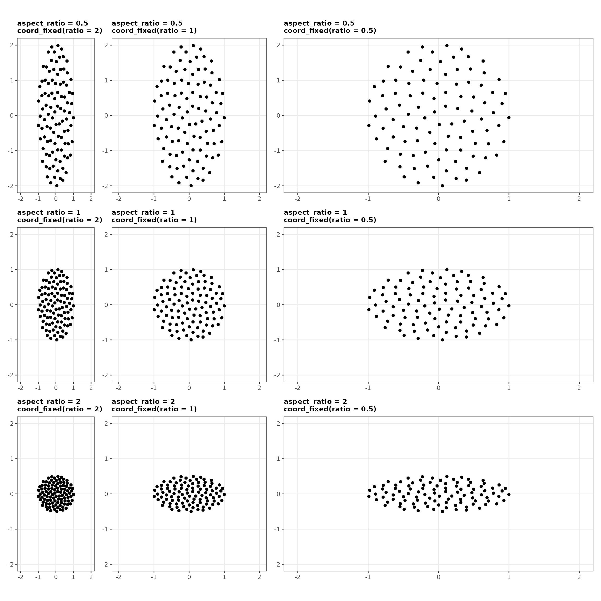
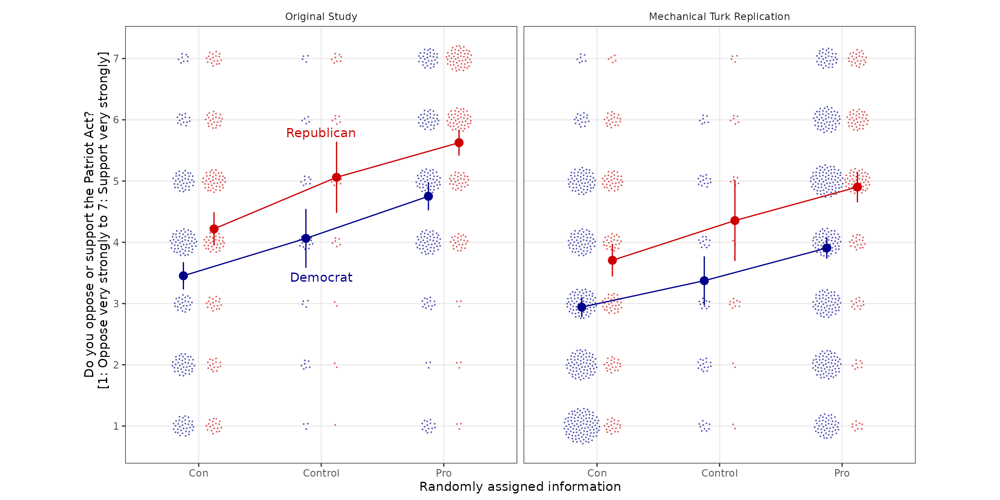

# Visualize as you randomize

The goal of `vayr` is to provide `ggplot2` extensions that foster
“visualize as you randomize” principles. These principles are outlined
in detail in “Visualize As You Randomize: Design-based Statistical
Graphs for Randomized Experiments,” a chapter in *Advances in
Experimental Political Science*
([PDF](https://alexandercoppock.com/coppock_2020.pdf),
[DOI](https://doi.org/10.1017/9781108777919.022)). The package includes
position adjustments that avoid over-plotting, which helps organize
“data-space” to better contextualize statistical models.

## Installation

The release version of `vayr` can be installed from CRAN, and the
development version can be installed from [GitHub](https://github.com/)
using a package like `remotes`, `devtools`, or `pak`. `vayr` relies on
`ggplot2`, `packcircles`, and `withr`, so these must be installed as
well.

``` r

# From CRAN
install.packages("vayr")

# From GitHub
# install.packages("pak")
pak::pak("acoppock/vayr")
```

## Contents

`vayr` contains a handful of `ggplot2` functions that apply as position
adjustments to “point-like” geoms such as `geom_point` or `geom_text`:

- [`position_jitter_ellipse()`](https://alexandercoppock.com/vayr/reference/position_jitter_ellipse.md)
  and
  [`position_jitterdodge_ellipse()`](https://alexandercoppock.com/vayr/reference/position_jitterdodge_ellipse.md)
- [`position_sunflower()`](https://alexandercoppock.com/vayr/reference/position_sunflower.md)
  and
  [`position_sunflowerdodge()`](https://alexandercoppock.com/vayr/reference/position_sunflowerdodge.md)
- [`position_circlepack()`](https://alexandercoppock.com/vayr/reference/position_circlepack.md)
  and
  [`position_circlepackdodge()`](https://alexandercoppock.com/vayr/reference/position_circlepackdodge.md)

These functions avoid over-plotting, so they are especially useful when
plotting discrete rather than continuous data. To demonstrate, we use
them below to visualize synthetic data, over-plotted at the origin.

``` r

library(dplyr)
library(estimatr)
library(ggplot2)
library(patchwork)
library(vayr)

set.seed(1)

dat <- data.frame(
  x = c(rep(0, 200)),
  y = c(rep(0, 200)),
  group = (rep(c("A", "B", "B", "B"), 50)),
  size = runif(200, 0, 1)
)
```

If position is the product of discrete variables alone, then
over-plotting is of particular concern.
[`position_jitter()`](https://ggplot2.tidyverse.org/reference/position_jitter.html)
can mitigate it. It introduces variation by randomly sampling points on
a rectangle. This approach is effective but can be unattractive. The
position adjustments in `vayr` aim to do better.

``` r

# perfectly over-plotted points
over_plot <- ggplot(dat, aes(x = x, y = y)) +
  geom_point() +
  coord_equal(xlim = c(-1.1, 1.1), 
              ylim = c(-1.1, 1.1)) +
  theme_bw() +
  theme(axis.title = element_blank(),
        plot.title = element_text(hjust = 0.5, face = "bold")) +
  ggtitle('"perfect over-plotting"')

# position_jitter()
jitter_plot <- ggplot(dat, aes(x = x, y = y)) + 
  geom_point(position = position_jitter(width = 0.5, 
                                        height = 0.5)) +
  coord_equal(xlim = c(-1.1, 1.1), 
              ylim = c(-1.1, 1.1)) +
  theme_bw() +
  theme(axis.title = element_blank(),
        plot.title = element_text(hjust = 0.5, face = "bold")) +
  ggtitle("position_jitter()")

over_plot + jitter_plot
```


### Position Jitter Ellipse

[`position_jitter_ellipse()`](https://alexandercoppock.com/vayr/reference/position_jitter_ellipse.md)
adds elliptical random noise to perfectly over-plotted points, offering
a pleasing way to visualize many points that represent the same
position. The benefit of sampling on an ellipse of a given `height` and
`width` rather than on a rectangle is that the resulting dispersion
retains the impression of a single point. The size of the ellipses stays
constant, while their density varies depending on the amount of data.

``` r

# position_jitter_ellipse()
jitter_ellipse_plot <- ggplot(dat, aes(x = x, y = y)) +
  geom_point(position = position_jitter_ellipse(width = 0.5, 
                                                height = 0.5)) +
  coord_equal(xlim = c(-1.1, 1.1), 
              ylim = c(-1.1, 1.1)) +
  theme_bw() +
  theme(axis.title = element_blank(),
        plot.title = element_text(hjust = 0.5, face = "bold")) +
  ggtitle("position_jitter_ellipse()")

# position_jitterdodge_ellipse()
jitterdodge_ellipse_plot <- ggplot(dat, aes(x = x, y = y, color = group)) +
  geom_point(position = position_jitterdodge_ellipse(dodge.width = 2, 
                                                     jitter.width = 0.5, 
                                                     jitter.height = 0.5)) +
  coord_equal(xlim = c(-1.1, 1.1), 
              ylim = c(-1.1, 1.1)) +
  theme_bw() +
  theme(legend.position = "none",
        axis.title = element_blank(),
        plot.title = element_text(hjust = 0.5, face = "bold")) +
  ggtitle("position_jitterdodge_ellipse()")
  
jitter_ellipse_plot + jitterdodge_ellipse_plot
```


### Position Sunflower

[`position_sunflower()`](https://alexandercoppock.com/vayr/reference/position_sunflower.md)
arranges perfectly over-plotted points using a sunflower algorithm,
which produces a pattern that resembles the seeds of a sunflower,
working from the inside out in the order of the data. The parameters for
this position adjustment are `density` and `aspect_ratio`. The size of
the flowers varies depending on the amount of over-plotting, but the
density of the pattern remains constant. A point with nothing
over-plotting it stays where it is. We generally recommend pairing the
position adjustment with
[`coord_equal()`](https://ggplot2.tidyverse.org/reference/coord_fixed.html),
in which case the default aspect ratio of 1 yields perfectly circular
flowers, but the aspect ratio of the flowers can be adjusted if need be.

``` r

# position_sunflower()
sunflower_plot <- ggplot(dat, aes(x = x, y = y)) +
  geom_point(position = position_sunflower(density = 1, 
                                           aspect_ratio = 1)) +
  coord_equal(xlim = c(-2.1, 2.1), 
              ylim = c(-2.1, 2.1)) +
  theme_bw() +
  theme(axis.title = element_blank(),
        plot.title = element_text(hjust = 0.5, face = "bold")) +
  ggtitle("position_sunflower()")
  
# position_sunflowerdodge()
sunflowerdodge_plot <- ggplot(dat, aes(x = x, y = y, color = group)) +
  geom_point(position = position_sunflowerdodge(width = 4, 
                                                density = 1, 
                                                aspect_ratio = 1)) +
  coord_equal(xlim = c(-2.1, 2.1), 
              ylim = c(-2.1, 2.1)) +
  theme_bw() + 
  theme(legend.position = "none",
        axis.title = element_blank(),
        plot.title = element_text(hjust = 0.5, face = "bold")) +
  ggtitle("position_sunflowerdodge()")
  
sunflower_plot + sunflowerdodge_plot
```


The `density` parameter controls the density of the pattern. A density
of 1 is normalized to 100 points in a unit circle; a density of 2, 200
points; and a density of 0.5, 50 points. Because density is normalized
relative to Cartesian units, its visual effect depends on the ranges of
the axes and the dimensions of the saved image. Smaller ranges or larger
dimensions require a greater density to produce the same visual effect.
Point size matters too.



The `aspect_ratio` parameter changes the aspect ratio of the flowers,
which is their width divided by their height. The parameter earns its
keep when the position adjustment is used without
[`coord_equal()`](https://ggplot2.tidyverse.org/reference/coord_fixed.html).
The flowers can be made wider or taller to compensate for the aspect
ratio of the axes or the image. Set `aspect_ratio` to the reciprocal of
the distortion you are correcting: flowers that render twice as wide as
they are tall need an `aspect_ratio` of 0.5.

For instance, consider a plot with an x axis that ranges from 0 to 1,
and a y axis that ranges from 0 to 2. Saving this plot as a square image
would squish the y axis, resulting in flowers twice as wide as they are
tall. An `aspect_ratio` of 0.5 offsets that distortion.

Under
[`coord_fixed()`](https://ggplot2.tidyverse.org/reference/coord_fixed.html)
the arithmetic is simpler, because `ratio` already expresses the
distortion you need to undo: set `aspect_ratio` to the same value as
`ratio` and the flowers come out circular. The two parameters agree in
value while being defined in opposite directions, since `aspect_ratio`
is width to height and `ratio` is height to width. The grid below
crosses the two, and the circular flowers appear where the values match,
running from the top right to the bottom left.



### Position Circle Pack

[`position_circlepack()`](https://alexandercoppock.com/vayr/reference/position_circlepack.md)
uses a circle packing algorithm from `packcircles` to arrange perfectly
over-plotted points of varying sizes into an elliptical area. It also
takes `density` and `aspect_ratio` as parameters. Do not confuse it with
`geom_circlepack()` from `ggcirclepack`, which can be found on
[GitHub](https://github.com/EvaMaeRey/ggcirclepack).

``` r

# position_circlepack()
circlepack_plot <- ggplot(dat, aes(x = x, y = y, size = size)) +
  geom_point(alpha = 0.25,
             position = position_circlepack(density = 0.25, 
                                            aspect_ratio = 1)) +
  coord_equal(xlim = c(-1, 1), 
              ylim = c(-1.1, 1.1)) +
  theme_bw() +
  theme(legend.position = "none",
        axis.title = element_blank(),
        plot.title = element_text(hjust = 0.5, face = "bold")) +
  ggtitle("position_circlepack()")
  
# position_circlepackdodge()
circlepackdodge_plot <- ggplot(dat, aes(x = x, y = y, color = group, size = size)) +
  geom_point(alpha = 0.25,
             position = position_circlepackdodge(width = 2, 
                                                 density = 0.25, 
                                                 aspect_ratio = 1)) +
  coord_equal(xlim = c(-1, 1), 
              ylim = c(-1.1, 1.1)) +
  theme_bw() + 
  theme(legend.position = "none",
        axis.title = element_blank(),
        plot.title = element_text(hjust = 0.5, face = "bold")) +
  ggtitle("position_circlepackdodge()")
  
circlepack_plot + circlepackdodge_plot
```


Like
[`position_sunflower()`](https://alexandercoppock.com/vayr/reference/position_sunflower.md),
[`position_circlepack()`](https://alexandercoppock.com/vayr/reference/position_circlepack.md)
works from the inside out in the order of the data. Arranging the data
by size therefore organizes the points accordingly.

``` r

# random size, base plot
random <- ggplot(dat, aes(x = x, y = y, size = size)) +
  geom_point(alpha = 0.25,
             position = position_circlepack(density = 0.075, 
                                            aspect_ratio = 1)) +
  coord_equal(xlim = c(-1, 1), 
              ylim = c(-1.1, 1.1)) +
  theme_bw() +
  theme(legend.position = "none",
        axis.title = element_blank(),
        plot.title = element_text(hjust = 0.5, face = "bold")) +
  ggtitle("random")

# ascending size
ascending <- random %+% 
  arrange(dat, size) + 
  ggtitle("ascending")
#> Warning: <ggplot> %+% x was deprecated in ggplot2 4.0.0.
#> ℹ Please use <ggplot> + x instead.
#> This warning is displayed once per session.
#> Call `lifecycle::last_lifecycle_warnings()` to see where this warning was
#> generated.

# descending size
descending <- random %+% 
  arrange(dat, desc(size)) + 
  ggtitle("descending")

random + ascending + descending
```


## Example

`vayr` also includes data from the Patriot Act experiment described in
[*Persuasion in
Parallel*](https://alexandercoppock.com/coppock_2022.html). The Patriot
Act was an anti-terrorism law, and the `patriot_act` dataset comes from
an experiment that measured support for this law after randomly exposing
participants to statements that cast the legislation in either a
negative or positive light. The experiment was conducted in 2009 with a
nationwide sample, and it was replicated in 2015 with a sample of
MTurkers. In both instances, the treatments had a similar effect on
Democrats and Republicans. The data hold four variables:

- `sample_label`, the study to which the participant belonged
- `pid_3`, the partisanship of the participant
- `T1_content`, the statements to which the participant was exposed
- `PA_support`, the participant’s post-treatment support for the Patriot
  Act

The figure below visualizes the data using
[`position_sunflowerdodge()`](https://alexandercoppock.com/vayr/reference/position_sunflowerdodge.md)
from `vayr`. It adjusts both `density` and `aspect_ratio`: a high
`density` compensates for the small point size, and a tall
`aspect_ratio` compensates for the wide plot.

``` r

# A df for statistical models
summary_df <- patriot_act |>
  group_by(T1_content, pid_3, sample_label) |>
  reframe(tidy(lm_robust(PA_support ~ 1)))

# A df for direct labels
label_df <- summary_df |>
  filter(sample_label == "Original Study", T1_content == "Control") |>
  mutate(
    PA_support = case_when(
      pid_3 == "Democrat" ~ conf.low - 0.15,
      pid_3 == "Republican" ~ conf.high + 0.15
    )
  )

ggplot(patriot_act, aes(T1_content, PA_support, color = pid_3, group = pid_3)) +
  # the data
  geom_point(position = position_sunflowerdodge(width = 0.5, 
                                                density = 50,
                                                aspect_ratio = 0.5),
             size = 0.1, alpha = 0.5) +
  # the statistical model
  geom_line(data = summary_df, aes(x = T1_content, y = estimate),  
            position = position_dodge(width = 0.5), linewidth = 0.5) +  
  geom_point(data = summary_df, aes(x = T1_content, y = estimate),  
             position = position_dodge(width = 0.5), size = 3) +
  geom_linerange(data = summary_df, aes(x = T1_content, y = estimate,
                                        ymin = conf.low, ymax = conf.high),
                 position = position_dodge(width = 0.5)) +
  # the direct labels
  geom_text(data = label_df, aes(label = pid_3)) +
  # the rest
  scale_color_manual(values = c("blue4", "red3")) +
  scale_y_continuous(breaks = 1:7) +
  coord_fixed(ratio = 0.5) + # ratio for coord_fixed is y/x rather than x/y
  facet_wrap(~sample_label) +
  theme_bw() +
  theme(legend.position = "none",
        strip.background = element_blank(),
        panel.grid.minor = element_blank()) +
  labs(y = "Do you oppose or support the Patriot Act?
            [1: Oppose very strongly to 7: Support very strongly]",
       x = "Randomly assigned information")
#> Warning: Removed 3 rows containing missing values or values outside the scale range
#> (`geom_point()`).
```



The figure shows the design, the data, and the analysis at once. Each
point is one respondent, arranged in flowers so that the number of
subjects sitting on each of the seven scale points stays visible. The
lines and vertical bars are group means with their 95 percent confidence
intervals.

Republicans support the Patriot Act more than Democrats do, by about a
point on the seven-point scale, in both the original study and the
replication. The treatments move the two groups by similar amounts and
in the same direction. In the original study, pro-Patriot Act statements
raise support by 0.69 points (robust standard error: 0.27) among
Democrats and by 0.57 (0.30) among Republicans, while anti-Patriot Act
statements lower it by 0.61 (0.26) and 0.84 (0.32). The replication
reproduces the pattern at slightly smaller magnitudes. The lines run
roughly parallel, separated by a level difference the treatments do not
close.

Plotting in data-space is what makes the parallelism legible. The
flowers show how much of each group sits at each scale point, so a
reader can see the spread that the group means summarize rather than
taking the intervals on faith.
